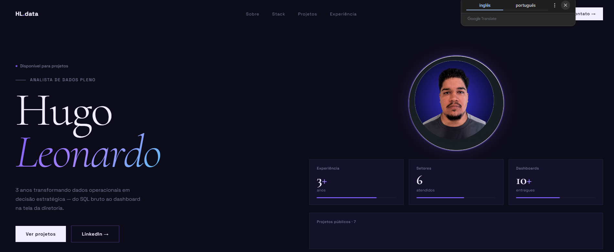

# Hugo Leonardo — Portfólio Pessoal

Portfólio profissional de Hugo Leonardo, Analista de Dados Pleno. Single-page application construída com React 19, TypeScript e Vite, apresentando projetos de SQL, Python, Machine Learning e Power BI.

---

**No ar:** https://hugoleonardonz.github.io/portfolio/



---

## Stack

| Tecnologia | Uso |
|---|---|
| React 19 | UI e componentização |
| TypeScript 6 | Tipagem estática |
| Vite 8 | Bundler e dev server |
| Tailwind CSS 4 | Utilitários de estilo |
| Lucide React | Ícones |

---

## Estrutura

```
portfolio/
├── index.html
├── package.json
├── vite.config.ts
├── tsconfig.json
├── public/
│   ├── hugo-foto.png       — Foto de perfil
│   ├── favicon.svg
│   └── icons.svg
└── src/
    ├── main.tsx            — Entry point
    ├── App.tsx             — Root component
    ├── Index.tsx           — Layout principal (montagem das seções)
    ├── index.css           — CSS global (Tailwind)
    ├── theme.ts            — Design tokens (cores, gradientes)
    ├── data/
    │   ├── projects.ts     — Array de projetos + interface Project
    │   └── content.ts      — Textos (serviços, experiência, about)
    ├── components/
    │   ├── GlobalStyles.tsx — Animações e fontes
    │   ├── Nav.tsx          — Navbar fixa com scroll effect
    │   ├── Hero.tsx         — Seção hero com foto e métricas
    │   ├── Ticker.tsx       — Faixa animada de tecnologias
    │   ├── Sobre.tsx        — Sobre mim + competências
    │   ├── OQueEntrego.tsx  — Grid de serviços
    │   ├── Skills.tsx       — Stack técnica
    │   ├── Projects.tsx     — Projetos em destaque
    │   ├── Experience.tsx   — Timeline de experiência
    │   ├── Contact.tsx      — Seção de contato
    │   ├── Footer.tsx       — Rodapé
    │   └── ui/
    │       ├── PIcon.tsx
    │       ├── Eyebrow.tsx
    │       ├── SectionTitle.tsx
    │       └── Em.tsx
    └── assets/
```

---

## Como Rodar

```bash
# Instalar dependências
npm install

# Iniciar servidor de desenvolvimento
npm run dev
# Acesse: http://localhost:5173

# Build de produção
npm run build

# Preview do build
npm run preview
```

---

## Seções

- **Hero** — Nome, cargo, foto e métricas (3+ anos, 6 setores, 10+ dashboards)
- **Ticker** — Faixa animada com tecnologias
- **Sobre** — Bio profissional e competências
- **O que entrego** — Grid de serviços (SQL, Power BI, Python, ETL, Churn, NOC)
- **Stack** — Habilidades por categoria
- **Projetos** — 8 projetos (7 públicos + 1 privado)
- **Experiência** — Timeline: Jr → Pleno na Speed Fibra + formação UNA
- **Contato** — Email, LinkedIn, GitHub

---

## Autor

**Hugo Leonardo** · Analista de Dados Pleno · Speed Fibra · Santa Luzia, MG  
[](https://www.linkedin.com/in/hugo-leonardo-data-analyst/)
[](https://github.com/HugoLeonardoNz)
